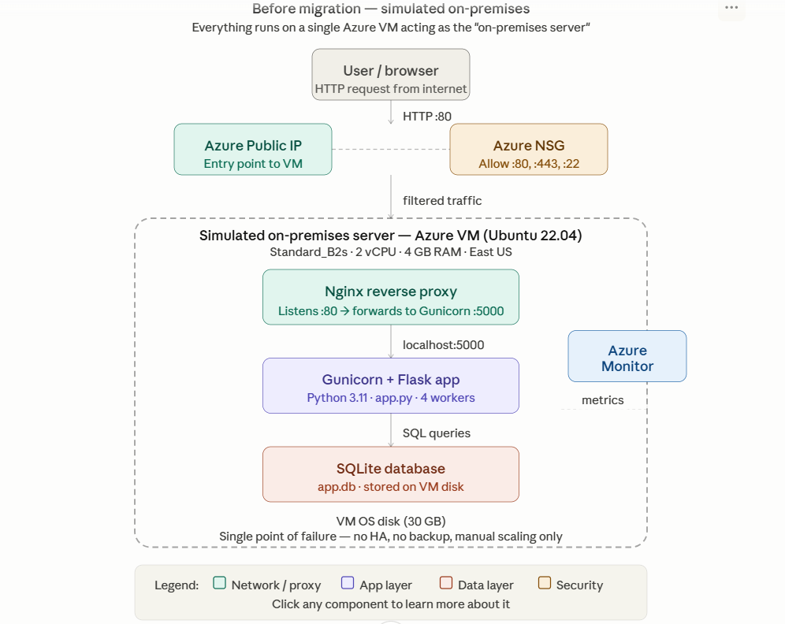

# Azure On-Premises to Cloud Migration


## Problem Statement

Many organisations run critical workloads on ageing on-premises infrastructure — high maintenance cost, no scalability, no built-in disaster recovery. This project simulates a real-world lift-and-shift migration from an on-premises environment to Azure, demonstrating the full migration lifecycle from assessment through to production deployment and BCDR setup.

## Architecture

### Before Migration — Simulated On-Premises


### After Migration — Azure Cloud


## What This Project Demonstrates

- Simulating an on-premises environment using Azure VM (Ubuntu 22.04)
- Running a Python Flask web application with SQLite database on the VM
- Azure Migrate assessment for migration readiness
- Database migration from SQLite to Azure SQL Database
- Application migration from VM to Azure App Service
- CI/CD pipeline with GitHub Actions for automated deployment
- Azure Backup with Recovery Services Vault for BCDR
- Azure Site Recovery for disaster recovery and failover
- Azure Monitor and Log Analytics for observability
- VNet with subnets and NSG rules for network security
- Infrastructure-as-Code using Azure Bicep

## Tech Stack

| Layer | Technology |
|---|---|
| Simulated On-Prem | Azure VM — Ubuntu 22.04 |
| Application | Python 3.11, Flask 3.0, Gunicorn |
| On-Prem Database | SQLite |
| Cloud Application Host | Azure App Service (Linux, P1v3) |
| Cloud Database | Azure SQL Database (General Purpose) |
| Networking | Azure VNet, Subnets, NSG |
| IaC | Azure Bicep |
| CI/CD | GitHub Actions |
| Backup | Azure Backup — Recovery Services Vault |
| Disaster Recovery | Azure Site Recovery |
| Monitoring | Azure Monitor, Log Analytics, Application Insights |
| Migration Assessment | Azure Migrate |

## Prerequisites

- Azure subscription (free tier or pay-as-you-go)
- Azure CLI >= 2.50 installed
- Python 3.11+
- Git

## Repository Structure

```text
azure-onprem-to-cloud-migration/
├── .github/
│   └── workflows/
│       └── deploy.yml          # GitHub Actions CI/CD pipeline
├── docs/
│   ├── architecture/
│   │   ├── before-migration.png
│   │   ├── after-migration.png
│   │   └── diagrams.drawio     # Editable source
│   ├── screenshots/            # Portal screenshots by day
│   └── migration-report.md     # Full migration report
├── infra/
│   ├── bicep/
│   │   ├── network.bicep       # VNet, subnets, NSGs
│   │   ├── vm.bicep            # On-prem simulation VM
│   │   └── sql.bicep           # Azure SQL resources
│   └── nsg-rules/
│       └── nsg-rules.json      # Exported NSG rules
├── app/
│   ├── app.py                  # Flask application
│   ├── requirements.txt
│   └── startup.sh              # App Service startup script
├── scripts/
│   ├── vm-setup.sh             # VM post-deployment setup
│   ├── migrate-db.sh           # SQLite to Azure SQL migration
│   └── teardown.sh             # Resource cleanup
└── README.md
```

## Setup Guide

> Full step-by-step instructions in [docs/runbooks/deployment.md](docs/runbooks/deployment.md)

### Quick Start

```bash
# Clone repository
git clone https://github.com/tarunkumar212/azure-onprem-to-cloud-migration
cd azure-onprem-to-cloud-migration

# Login to Azure
az login

# Deploy network infrastructure
az deployment group create \
  --resource-group rg-migration-project \
  --template-file infra/bicep/network.bicep
```

## Migration Phases

| Phase | Description | Status |
|---|---|---|
| Phase 1 | Foundation and repo setup | In Progress |
| Phase 2 | On-premises environment simulation | Planned |
| Phase 3 | Database and app migration | Planned |
| Phase 4 | BCDR — Backup and Site Recovery | Planned |
| Phase 5 | Monitoring and observability | Planned |

## Challenges and Lessons Learned

> This section will be updated throughout the project

## Cost Analysis

> Before vs after cost comparison will be added in Phase 4

## Author

**TARUN KUMAR S**
Network Developer at Wipro | AZ-900 | AZ-104
[LinkedIn](www.linkedin.com/in/tarun-kumar-s-0b40aa2a2) | [GitHub](https://github.com/tarunkumar212)
